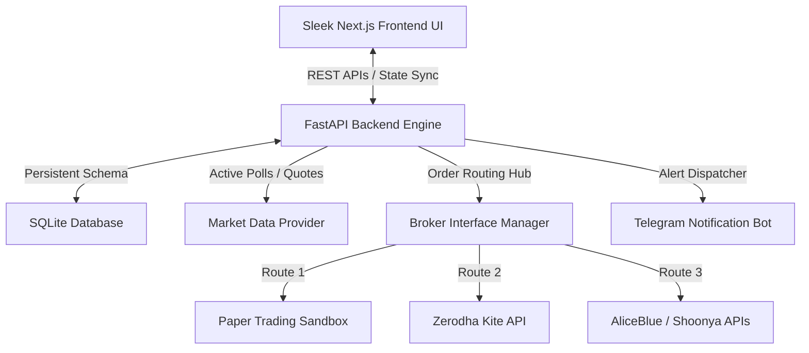

# 🚀 Stocker - Algorithmic Options Trading Engine

**Stocker** is a premium, professional-grade algorithmic options trading platform designed for the Indian markets (NSE). Built on a modern decoupled architecture, it enables retail traders to deploy, backtest, and live-trade stateful options strategies with surgical precision, real-time risk controls, and instant Telegram notification streams.

---

## 📸 Key Features

* **Strategy Blueprint & Instance decoupled Library:** Create master strategy templates (Blueprints) and activate multiple independent, concurrent running instances configured on different symbols with custom lot sizes, risk thresholds, and sandbox/live modes.
* **Refined ORB (Opening Range Breakout) Engine:** Fully automated execution of the 1-minute ORB strategy using double-breakout validation (Index Spot + Option Chart High) with strict invalidation rules, premium selection safety bounds (₹100–₹200), and automated re-entry targets adjustment (Target 15% for trade recovery).
* **Multi-Broker Hub:** Seamless out-of-the-box integration with standard Indian discount brokers (Zerodha Kite, Shoonya, AliceBlue) along with a high-fidelity **Paper Trading Sandbox Broker** for real-time riskless practice.
* **Stateful Filtering Trade Ledger:** Premium Next.js UI grid displaying real-time executions, searchable, and instantly sliceable by Strategy, Active symbol, Status, and execution environment (Paper/Live).
* **Instant Notification Stream:** Multi-client Telegram alerting system pushing immediate entries, targets, stop-losses, and EOD squareoffs complete with detailed IST timestamps, PnL summaries, and active parameters.

---

## 🏗️ System Architecture



---

## ⚡ Opening Range Breakout (ORB) Refined Logic

Stocker features a custom, high-precision implementation of the **Opening Range Breakout** options strategy with the following advanced parameters (Z ragu rules):

1. **Double Breakout Confirmation:** First, the Index Spot (Nifty 50 / BankNifty) must break out above its first 1-minute candle high (Bullish) or below its low (Bearish). Second, the corresponding option contract (CE/PE) must break above its opening 1-minute high.
2. **Option High Invalidation:** If the option contract premium spikes above its opening high *before* the Nifty index spot does, the contract is flagged as invalidated for the day to prevent whipsaw traps.
3. **100-200 Premium Band Filter:** The engine dynamically shifts selected strikes OTM to guarantee that the option contract entry premium falls strictly between ₹100 and ₹200 at entry.
4. **Re-Entry Target Boost (Max 2 trades):** If the first trade is stopped out at **10% SL**, the strategy waits for the opposite breakout direction. The second trade is initiated with **10% SL** and a scaled-up **15% Profit Target** for maximum mathematical recovery.
5. **Time Cutoff Rule:** No new entries are allowed under any circumstances after **11:00 AM IST**.

---

## 🛠️ Installation & Setup

### Prerequisites
* Python 3.10+
* Node.js 18+

### 1. Backend Setup
```bash
cd backend
# Create and activate virtual environment
python3 -m venv venv
source venv/bin/activate

# Install dependencies
pip install -r requirements.txt

# Run migrations and start development server
uvicorn app.main:app --host 127.0.0.1 --port 8000 --reload
```

### 2. Frontend Setup
```bash
cd frontend
# Install dependencies
npm install

# Start production-grade dev environment
npm run dev
```

### 3. Unified Startup
Use the provided unified shell script to launch both systems concurrently:
```bash
./start.sh
```

---

## 📄 License & Disclaimer

Stocker is distributed under the MIT License. **Disclaimer:** Algorithmic trading involves substantial risk of loss. This software is provided for educational and sandbox testing purposes. Past performance is not indicative of future results.
