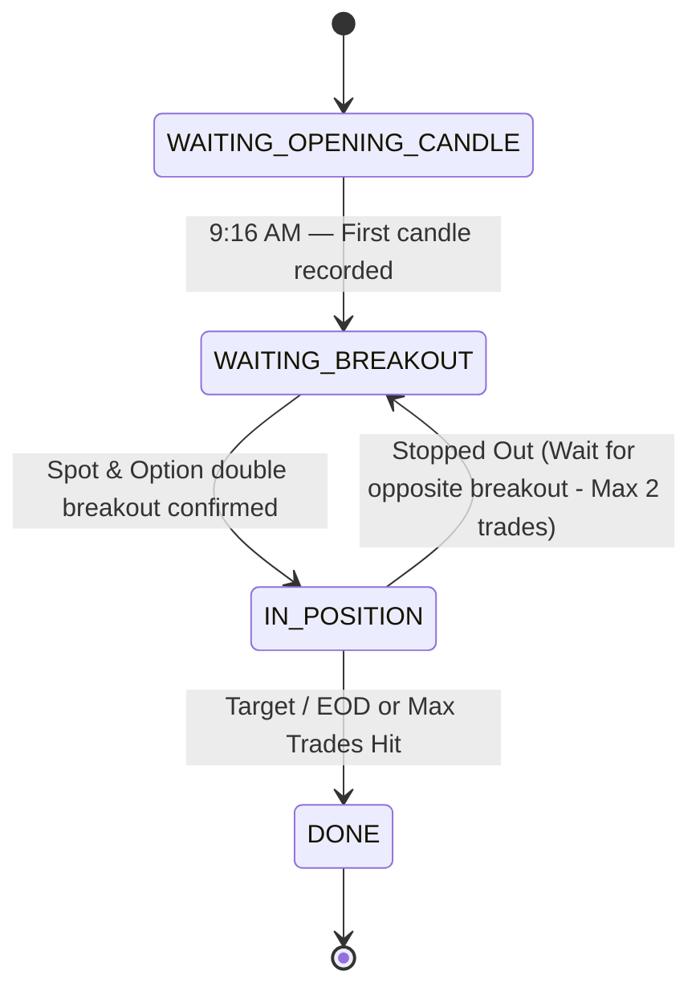

# ORB — Opening Range Breakout Strategy

> **Author:** Stocker Engine  
> **Type:** Intraday Options Strategy  
> **Market:** NSE (Nifty 50 / BankNifty)  
> **Timeframe:** 9:15 AM – 3:15 PM IST (Cutoff 11:00 AM IST)

---

## Overview

The Opening Range Breakout (ORB) strategy is a multi-phase intraday options strategy that uses the first 1-minute candle of the trading day as a reference range. It waits for the market to break above or below this range, then takes a directional options trade with double breakout validation (Index Spot + Option Chart High) and predefined risk management.

## Strategy Phases



### Phase 1: WAITING_OPENING_CANDLE
- **When:** Market opens at 9:15 AM  
- **Action:** Wait for the first 1-minute candle to complete (9:15–9:16)
- **Records:** 
  - Index Spot HIGH, LOW, and CLOSE
  - Pre-selected CE & PE Strikes based on the 9:16 spot close price (Premium range ₹100–₹200)
  - Mathematical option opening candle HIGHs (`ce_option_opening_high`, `pe_option_opening_high`)
- **Telegram Alert:** `🎯 ORB Opening Range Set (1-Min)` with Index and Option parameters

### Phase 2: WAITING_BREAKOUT
- **When:** After 9:16 AM until 11:00 AM IST (No new entries allowed after 11:00 AM)
- **Action:** Monitor real-time spot and pre-selected options premiums every 5 seconds
- **Double Breakout Rules:**
  1. **Index Breakout:** The Nifty Spot must cross above the Opening HIGH (Bullish) or below the Opening LOW (Bearish).
  2. **Option High Invalidation:** If the pre-selected Option contract breaches its own opening candle HIGH *before* the Index Spot breaks out, that option's entry is invalidated for the day.
  3. **Option Breakout Entry:** Entry triggers *only if* the Index Spot has broken out, and *then* the respective Option premium crosses above its own opening candle HIGH.
- **Max Entries & Re-entries:**
  - Maximum of 2 entries per day (one High breakout CE trade, one Low breakout PE trade).
  - If the first trade hits target or timeline, strategy is DONE.
  - If the first trade hits 10% Stop Loss, the strategy transitions back to `WAITING_BREAKOUT` to wait for the opposite-side breakout.

### Phase 3: IN_POSITION
- **When:** After double breakout is confirmed
- **Action:** Monitor option premium for exit conditions
- **Exit Conditions:**
  - 🎯 **TARGET:** 
    - First Trade: Premium rises +10% from entry
    - Second Trade (Opposite breakout after SL): Premium rises +15% from entry
  - 🔻 **STOP LOSS:** Premium falls -10% from entry
  - 🕒 **EOD SQUAREOFF:** Auto-exit at 3:15 PM if still open

### Phase 4: DONE
- Strategy goes dormant until next market open

---

## Option Selection Logic

```
1. Calculate ATM Strike:
   ATM = round(spot / step) × step
   (step = 50 for Nifty, 100 for BankNifty)

2. Estimate Premium:
   premium = intrinsic + (strike × 0.005)

3. Premium Filter (₹100 – ₹200):
   IF premium > ₹200 → shift to OTM strikes until within range
   IF premium < ₹100 → shift to ITM strikes until within range

4. Entry Price = estimated premium of selected strike
```

### Example
```
Spot: 24720
ATM Strike: 24700 CE
Estimated Premium: ₹135

Premium ₹135 is within ₹100-₹200 ✓
→ BUY 24700 CE @ ₹135
→ Target: ₹148.50 (+10%)
→ SL: ₹121.50 (-10%)
```

---

## Configuration (JSON)

```json
{
  "strategy_type": "orb_breakout",
  "symbols": ["NSE:NIFTY 50"],
  "timeframes": {
    "opening_candle_tf": "minute",
    "pre_1030_tf": "minute",
    "post_1030_tf": "5minute"
  },
  "opening_range": {
    "candle_time": "09:15"
  },
  "option_selection": {
    "strike_selection": "ATM",
    "premium_min": 100,
    "premium_max": 200,
    "shift_to_otm_if_exceeded": true
  },
  "risk": {
    "target_pct": 10.0,
    "stop_loss_pct": 10.0
  },
  "action": {
    "instrument_type": "OPTION",
    "quantity": 50,
    "expiry_type": "WEEKLY",
    "paper_trade": true
  },
  "timeline": {
    "start_time": "09:15",
    "end_time": "15:15",
    "days_of_week": [1, 2, 3, 4, 5]
  }
}
```

---

## Files & Architecture

| File | Purpose |
|------|---------|
| `backend/app/orb_strategy.py` | Core ORB engine — `ORBState` dataclass + `ORBStrategyEngine` for backtesting |
| `backend/app/engine.py` | Live execution — `evaluate_orb_strategy()` runs in the 5-sec engine loop |
| `backend/app/main.py` | Seeds default ORB config + `/api/backtest` delegates to `_run_orb_backtest()` |
| `frontend/app/components/CustomBuilder.tsx` | UI panel for ORB configuration (premium, timeframe, risk) |

### Data Flow

```
Engine Loop (every 5s)
  ├── fetch_live_spot() → Kite LTP or mock
  ├── strategy_type == "orb_breakout"?
  │   └── evaluate_orb_strategy()
  │       ├── Phase 1: _fetch_915_candle() → Kite Historical API
  │       ├── Phase 2: Compare spot vs opening range
  │       ├── Phase 3: Delta-based premium estimation
  │       └── broker.place_order() → PAPER or KITE
  └── strategy_type == "custom"?
      └── evaluate_strategy_entry/exit()
```

---

## Telegram Notifications

All notifications include IST timestamps:

| Event | Emoji | Fields |
|-------|-------|--------|
| Opening Range Set | 🎯 | Strategy, High, Low, Time |
| Buy Triggered | 🟢 | Direction, Option, Entry, Target, SL, Buy Time |
| Target Hit | 🟢 | Entry, Exit, P&L, Buy Time, Sell Time |
| Stop Loss Hit | 🔴 | Entry, Exit, P&L, Buy Time, Sell Time |
| EOD Squareoff | 🕒 | Entry, Exit, P&L, Buy Time, Sell Time |

---

## Risk Management

| Parameter | Default | Description |
|-----------|---------|-------------|
| `target_pct` | 10% | Profit target from entry premium |
| `stop_loss_pct` | 10% | Max loss from entry premium |
| `premium_min` | ₹100 | Minimum acceptable option premium |
| `premium_max` | ₹200 | Maximum acceptable option premium |
| EOD Squareoff | 15:15 | All positions closed before market close |
| Max Trades/Day | 1 | Only one trade per strategy per day |

---

## Backtesting

The ORB strategy can be backtested via the `/api/backtest` endpoint:

```bash
POST /api/backtest
{
  "strategy_id": "orb_breakout_nifty",
  "from_date": "2026-05-20",
  "to_date": "2026-05-24",
  "initial_capital": 100000
}
```

Returns: `summary`, `equity_curve`, `visualization`, `trades`, `journal`

The backtest engine (`ORBStrategyEngine.run_backtest()`) processes candles day-by-day, simulating the full phase machine independently for each trading day.
